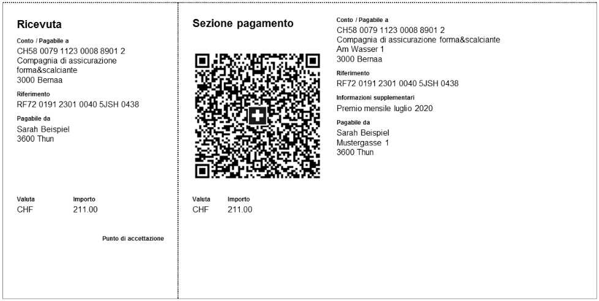
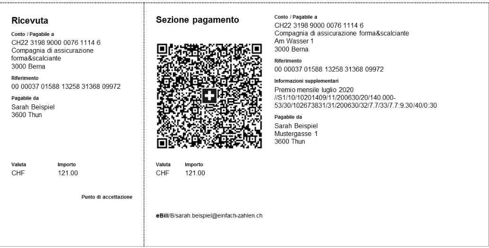
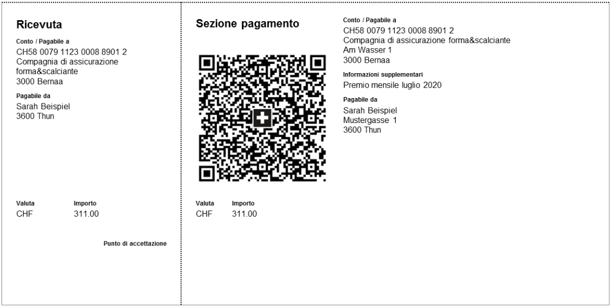
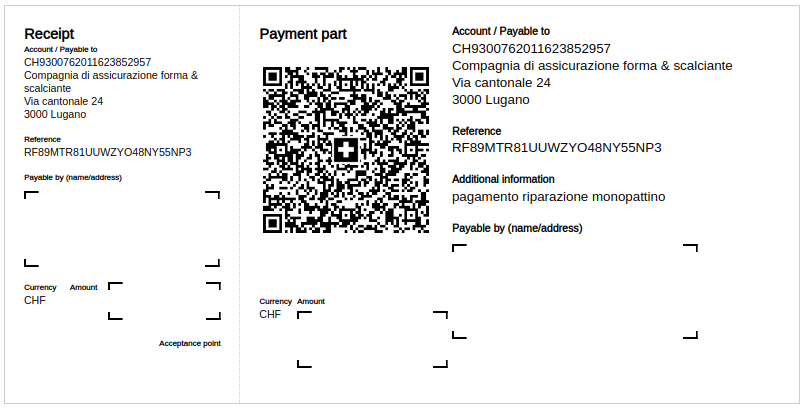

[](https://travis-ci.com/damoiser/qr-bills)

[](https://badge.fury.io/rb/qr-bills)
[](https://www.paypal.com/donate?business=DJNJMV5YAEBT6&currency_code=CHF)

QR-Bills gem for implementing Swiss payments.

## Notes

Please note that **no checks are performed to validate IBAN and references (like Creditor Reference)** when submitting the params.
These checks are required to be performed by the application.

## Installation

### Gem installation

```bash
gem install qr-bills
```
* [Rubygems > qr-bills](https://rubygems.org/gems/qr-bills)

### Locales / Translations

To support translations, copy/paste the 4 languages code into your I18n engine: `config/locales/*.yml`

## Usage

### Generate a creditor reference (ISO-11649) number

The creditor reference is composed as follow:
* RF + 2 check digits + reference

Max reference length is 21 chars.

```ruby
QRBills.create_creditor_reference("MTR81UUWZYO48NY55NP3")
# => "RF89MTR81UUWZYO48NY55NP3"
```

### Availables outputs formats

```ruby
params[:output_params][:format] = "html"
# OR
params[:output_params][:format] = "qrcode_png"
```

* `html` returns a full qr-bill as a html-template string
* `qrcode_png` returns the qrcode of the qr-bill

### Availables qr-bill types formats

#### QR bill with (new) creditor reference

This is a new bill type introduced with the new qr bills format
```ruby
params[:bill_type]                      = QRBills.get_qrbill_with_creditor_reference_type
params[:bill_params][:reference_type]   = "SCOR" # fixed type for bill with creditor reference
params[:bill_params][:reference]        = "RF89MTR81UUWZYO48NY55NP3" # example
```



#### QR bill with (old) reference type

This can be compared to the (old) orange bill type
```ruby
params[:bill_type]                      = QRBills.get_qrbill_with_qr_reference_type
params[:bill_params][:reference_type]   = "QRR" # fixed type for bill with qr reference
params[:bill_params][:reference]        = "00 00037 01588 13258 31366 09972" # example
```



#### QR bill without reference

This can be compared to the (old) red bill type
```ruby
params[:bill_type]                      = QRBills.get_qrbill_without_reference_type
params[:bill_params][:reference_type]   = "NON" # fixed type for bill without reference
```



### Generate a QR-Bill

```ruby
# get the QR params, so you will get the full hash structure and as well some default values
params = QRBills.get_qr_params

# fill the params, for example
params[:bill_type]                                      = QRBills.get_qrbill_with_creditor_reference_type
params[:qrcode_filepath]                                = "#{Dir.pwd}/tmp/qrcode-html.png"
params[:output_params][:format]                         = "html"
params[:bill_params][:creditor][:iban]                  = "CH93 0076 2011 6238 5295 7"
params[:bill_params][:creditor][:address][:type]        = "S"
params[:bill_params][:creditor][:address][:name]        = "Compagnia di assicurazione forma & scalciante"
params[:bill_params][:creditor][:address][:line1]       = "Via cantonale"
params[:bill_params][:creditor][:address][:line2]       = "24"
params[:bill_params][:creditor][:address][:postal_code] = "3000"
params[:bill_params][:creditor][:address][:town]        = "Lugano"
params[:bill_params][:creditor][:address][:country]     = "CH"
params[:bill_params][:amount]                           = 12345.15
params[:bill_params][:currency]                         = "CHF"
params[:bill_params][:debtor][:address][:type]          = "S"
params[:bill_params][:debtor][:address][:name]          = "Foobar Barfoot"
params[:bill_params][:debtor][:address][:line1]         = "Via cantonale"
params[:bill_params][:debtor][:address][:line2]         = "25"
params[:bill_params][:debtor][:address][:postal_code]   = "3001"
params[:bill_params][:debtor][:address][:town]          = "Comano"
params[:bill_params][:debtor][:address][:country]       = "CH"
# you can get the new creditor reference using QRBills.create_creditor_reference("your_reference") 
params[:bill_params][:reference]                        = "RF89MTR81UUWZYO48NY55NP3" 
params[:bill_params][:reference_type]                   = "SCOR"
params[:bill_params][:additionally_information]         = "pagamento riparazione monopattino"

# generate the QR Bill
bill = QRBills.generate(params)

# bill format is given in the params, default is html
# bill has the following format:
#    bill = {
#      params: params,
#      output: "output"
#    }

```

## References
* https://www.paymentstandards.ch/dam/downloads/ig-qr-bill-en.pdf
* https://www.paymentstandards.ch/en/shared/know-how/faq/qr.html
* https://www.kmu.admin.ch/kmu/it/home/consigli-pratici/questioni-finanziarie/contabilita-e-revisione/introduzione-della-qr-fattura.html
* https://www.paymentstandards.ch/dam/downloads/drehbuch-rechnung-steller-empfaenger-it.pdf

## TODO

* add other outputs formats
* add "empty" QR-Bill


## License

BSD-3
